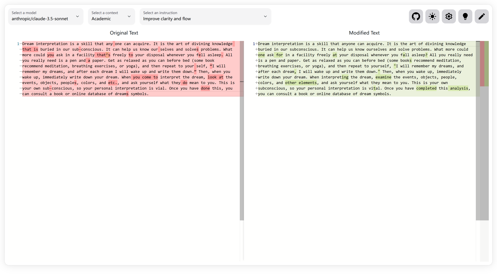

# Waner Proofreader

Waner Proofreader is an AI-powered tool designed to help non-native English speakers proofread their text smoothly.

> The tool is named after <del>the character Shangguan from the game Honor of Kings (王者荣耀里的上官婉儿)</del> the historical figure Shangguan Wan'er (上官婉儿), a renowned Chinese poet and politician.

Here is a [demo](https://waner.auroradysis.com). You need to configure your own API URL and key to use it.

# Screenshots



# Installation

## Docker Installation

To run Waner Proofreader using Docker, use the following docker-compose file:

```yaml
services:
  waner-proofreader:
    image: ghcr.io/auroradysis/waner-proofreader:latest
    container_name: waner-proofreader
    restart: unless-stopped
    ports:
      - 3000:3000
    volumes:
      - ./config.toml:/app/config.toml
    environment:
      - CONFIG=/app/config.toml or <base64 encoded TOML>
```

where `<base64 encoded TOML>` is the base64 encoded TOML configuration file or `<path to TOML file>` is the path to the TOML configuration file. The TOML file `config.toml` should contain the following information:

```toml
models = ["openai/gpt-4o", "google/gemini-2.5-pro-preview-03-25", "x-ai/grok-3-beta", "qwen/qwen3-235b-a22b", "openai/gpt-4.1", "google/gemini-2.5-flash-preview", "qwen/qwen-max", "openai/chatgpt-4o-latest"]

[[users]]
name = "name"
key = "password"
openai_base_url = "base url of API endpoint, for example, https://openrouter.ai/api/v1 or https://api.openai.com/v1"
openai_api_key = "your api key of the endpoint"

# other users
[[users]]
...
```

If you want to use providers other than OpenRouter, you may need to modify `models` accordingly. Replace
`<openai_base_url>` and `<your_api_key>` with your actual API key and base URL, which should be compatible with the OpenAI API. The `models` field should contain a list of models you want to use, and you can add or remove models as needed.

You can also add multiple users by adding more `[[users]]` sections.

## Local Installation

To run Waner Proofreader locally, ensure that you have Node.js installed on your machine. Follow these steps to set up the project:

1. Clone the repository:

   ```bash
   git clone https://github.com/AuroraDysis/waner-proofreader.git
   ```

2. Navigate to the project directory:

   ```bash
   cd waner-proofreader
   ```

3. Install the required dependencies:

   ```bash
   pnpm install
   ```

4. Create a `.env` file in the root directory and add `CONFIG` as previously mentioned.

5. Start the development server:

   ```bash
   pnpm run dev
   ```

6. Open your web browser and visit `http://localhost:3000` to access Waner Proofreader.

# Credits

- Some parts of the code & prompts are inspired by [refiner](https://github.com/imankulov/refiner)
- Some prompts are inspired by [editGPT](https://editgpt.app/?via=zhen)
- Some prompts are inspired by [GenAI LaTeX Proofreader](https://github.com/genai-latex-proofreader/genai-latex-proofreader)

# Licenses

waner-proofreader is licensed under the MIT License. See [LICENSE](./LICENSE) for more information.
